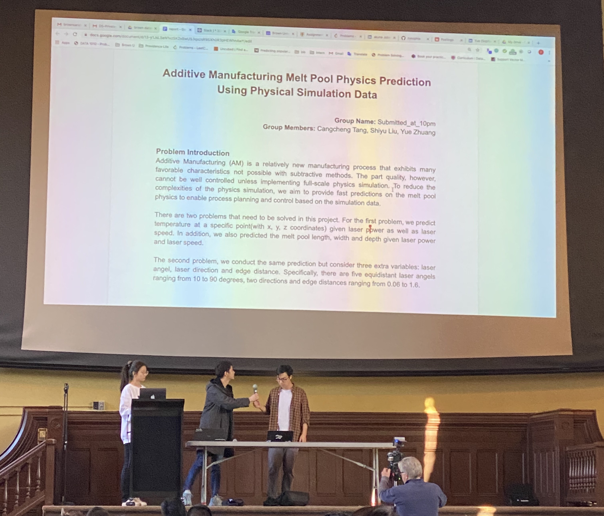

Last week, my friends and I participated in the 2020 Brown Datathon. We picked up the problem to investigate into how machine learning could help to improve the performace of 3D printing by providing an accurate prediction on the temperature and melting size of the material. Our team won first place of category and got Apple Watches as the prize! 

{: .center-block :}

We have posted our work on [Medium](https://medium.com/@bzybc1405/additive-manufacturing-melt-pool-physics-prediction-using-physical-simulation-data-4596da4e1b38). And I believe the most interesting part of the work is that we found out DL and ML could actually provide highly accurate predictions for physics precedures, in which domain we used to focus on mainly simulation methods. And our work is also a good show case to see how feature engineering could help to improve a model. Those task-based feature engineering could greatly enhance a ML model.

{: .center-block :}

Thank you Dassault Systems for providing the data and funding such a great event!
